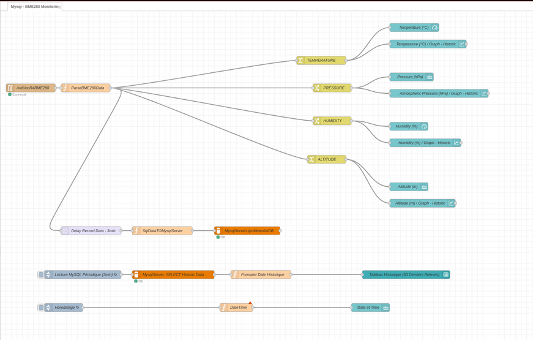
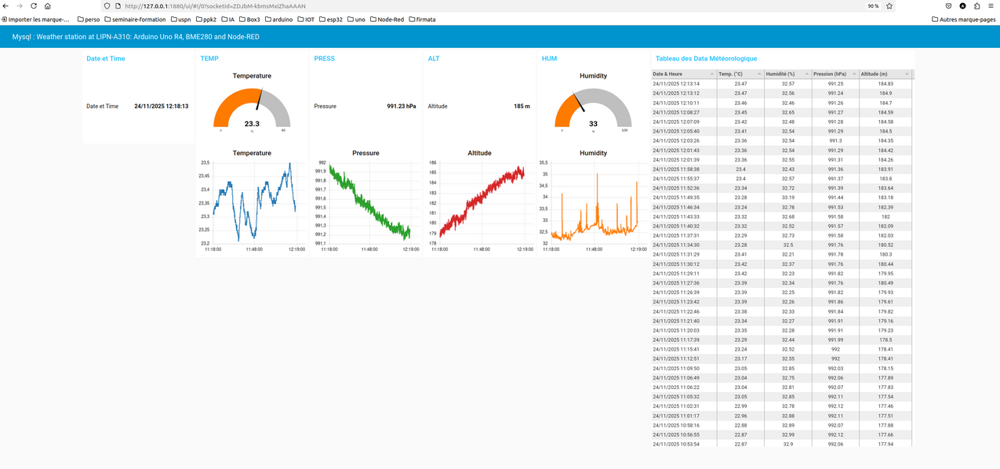

<center><h2>Conception and Deployment of a Distributed Architecture
for the Acquisition, Real-Time Visualization, and
Persistence of Meteorological Data: Implementation of a
Client-Server System Based on Arduino Uno R4 WiFi,
BME280 Sensor and the Node-RED/MySQL Platform</h2></center>


**Abstract**
This study presents the methodology and implementation of an Internet of Things
(IoT) instrumentation chain dedicated to environmental monitoring. The system is
structured around a client-server architecture: the Arduino Uno R4 WiFi micro-
controller board acts as the acquisition client, utilizing the I2C protocol to interface
with the BME280 environmental sensor (Temperature, Humidity, Pressure, Alti-
tude). Data transmission is ensured via the USB-C serial port. The Node-RED
low-code programming platform is deployed as the central server, responsible for
receiving, analyzing (parsing), and managing the data flow. A key methodological
objective is to ensure long-term data persistence by integrating a MySQL database,
using a parameterized injection technique to optimize the security and integrity of
the records. This work demonstrates a robust and scalable solution for scientific
data collection.
Keywords: IoT, BME280, Arduino Uno R4 WiFi, Node-RED, MySQL, I2C, Data
Persistence, Low-Code Programming.

## 1 Introduction
Access to accurate and historically rich environmental datasets is fundamental for cli-
mate modeling and local monitoring. The emergence of IoT devices offers opportunities
for low-cost, high-frequency data collection solutions. The BME280 sensor is recog-
nized for its capacity to provide three-dimensional measurements (temperature, humid-
ity, pressure). This document describes the establishment of a complete and distributed
architecture, solving the challenge of integrating simple hardware acquisition (Arduino)with web services for visualization and secure archiving (Node-RED/MySQL). Our con-
tribution focuses on the detailed description of communication protocols, data analysis
methods (parsing CSV to JSON), and the implementation of a secure insertion flow into
a relational database.

## 2 Materials and Methods
### 2.1 Client Hardware Architecture
The acquisition module (Client) is centered around the Arduino Uno R4 WiFi micro-
controller.

#### 2.1.1 Interfacing the BME280 Sensor
The BME280 environmental sensor is connected to the Arduino via the I2C (Inter-
Integrated Circuit) protocol. Standard wiring requires connecting the clock line (SCL)
to pin A5 (or dedicated SCL) and the data line (SDA) to pin A4 (or dedicated SDA)
on the Arduino board. Power compatibility is managed (5V or 3.3V) according to the
specific configuration of the BME280 module used.

#### 2.1.2 Acquisition and Transmission Protocol
The embedded code (sketch) requires the integration of the Adafruit Unified Sensor
and Adafruit BME280 libraries. The initialization of serial communication is set at
9600 bauds. In the execution loop (loop):
1. Readings include temperature (Celsius, bme.readTemperature()), relative humid-
ity (bme.readHumidity()) and atmospheric pressure. The pressure is immediately
normalized to hectopascals (hPa) by division by 100.0.
2. Altitude is calculated with reference to the standard atmospheric pressure at sea
level, defined at 1013.25 hPa (SEALEVELPRESSURE_HPA).
3. The four readings are serialized and transmitted on the USB-C port as a CSV
(Comma Separated Values) string, following the ordered format T,H,P,A
(Temperature, Humidity, Pressure, Altitude).
4. A strict temporal sampling interval of 1.5 seconds is maintained between each
dataset transmission.

### 2.2 Server Processing with Node-RED
The Node-RED platform, a low-code development environment based on Node.js, cen-
tralizes data processing and management.

#### 2.2.1
Flow Ingestion and Analysis
The data is ingested by a Serial in Node, whose port and baud rate (9600 bauds)
parameters must rigorously match the Arduino configuration. The CSV string is ana-
lyzed by a Function Node, named Parse BME280 Data. This node uses the JavaScript
instruction split(’,’) to decompose the input string (msg.payload). Each segment is
then converted to a floating-point number (parseFloat) and structured into a JSON
data object, defining a clear data schema for subsequent steps:
```JSON
msg.payload = {temp,hum,press,alt}
```
#### 2.2.2 Real-Time Visualization
The Node Dashboard module is used to generate the web user interface, accessible
locally (e.g., http://127.0.0.1:1880/ui). Gauge nodes are configured for tempera-
ture (range 0 to 40◦ C) and humidity (range 0 to 100%), offering an immediate reading.
Chart nodes ensure a linear graphical visualization of the history for each measurement.

## 3 Integration for Data Persistence (MySQL)
Archiving meteorological readings is crucial for historical trend analysis and scientific
data sharing. The Node-RED flow is extended to integrate a MySQL database.

### 3.1 Database Environment Configuration
A database named meteo_iot and a table releves_bme280 are pre-configured on the
MySQL server. The table is structured to store the measurements with the required
precision: timestamp (default timestamp), temperature (DECIMAL(5, 2)), humidite
(DECIMAL(5, 2)), pression (DECIMAL(7, 2)), and altitude (DECIMAL(6, 2)).

### 3.2 Secure Insertion Method (Write Branch)
Data insertion uses the node-red-node-mysql node. For reasons of robustness and
security (prevention of SQL injection attacks), an intermediary Function node (Creer
Requete SQL) is inserted after the parsing node. This node dynamically builds the
insertion SQL query:
1. It retrieves the numerical values (T, H, P, A) from the JSON object msg.payload.
2. It defines the SQL command using placeholders (?) for the values to be inserted,
assigned to the property msg.topic.
3. It defines the property msg.payload as an ordered array containing the correspond-
ing values [T, H, P, A].
The MySQL node executes the secure query by substituting the placeholders with the
values from the msg.payload array.

## 4 Results and Retrieval of Archived Data
The system operates with two independent logical branches within Node-RED: the real-
time insertion branch and the historical reading branch.

### 4.1 Historical Reading Flow (Read Branch)
A distinct flow is created for the periodic retrieval of archived data. This flow is initiated
by an Inject Node, configured to trigger at a defined interval (for example, 1 or 5
minutes) and on startup. The MySQL (Reading) node executes a SELECT query
directly in its configuration field. This query is formulated to retrieve a limited set of
the most recent readings (for example, the last 50) to optimize display:
```SQL
SELECT timestamp, temperature, humidite, pression, altitude
FROM releves_bme280
ORDER BY timestamp DESC LIMIT 50;
```

### 4.2 Formatting for Presentation
The raw results are routed to a Function Node (table formatting). This node is
essential for improving user-friendliness by converting the database timestamp into a
localized French string (timestamp_fr).

### 4.3 Dynamic Display
The ui-table node displays this structured data. The table configuration specifies the
alignment and numerical formatting (two decimal places) for each column (Temperature,
Humidity, Pressure, Altitude), guaranteeing a clear and precise presentation of historical
data.

## 5 Discussion and Perspectives
This architecture demonstrates the effectiveness of Node-RED in bridging the gap be-
tween micro-controlled systems and the requirements of modern web infrastructure. The
low-code approach allows for rapid implementation while maintaining the robustness nec-
essary for scientific archiving through the use of parameterized SQL queries. The use of
the Arduino Uno R4 WiFi opens significant perspectives for the evolution of the system
towards a truly autonomous station. The current dependence on a wired USB connection
for serial data transmission can be eliminated by using standard IoT network protocols,
such as MQTT or HTTP. Furthermore, the extensibility of Node-RED allows for the
integration of alert mechanisms, where additional nodes could monitor data flows and
trigger notifications (e-mail or SMS) if critical environmental thresholds are exceeded
(for example, a temperature above 30◦ C).

## 6 Conclusion
We have developed a highly integrated and modular environmental instrumentation plat-
form, combining the precise reading of the BME280 by the Arduino Uno R4 WiFi,
dynamic processing via Node-RED, and secure archiving in a MySQL database. This
model serves as a reference for creating reliable IoT solutions capable of managing both
real-time visualization and historical management of vast environmental datasets. The
implemented system is similar to a centralized research infrastructure. The Arduino
Uno R4 WiFi acts as a field researcher, performing precise measurements (BME280)
and sending them to the data center (Node-RED). Node-RED functions as the analysis
laboratory and database manager, where raw data is transformed (JSON parsing), dis-
played to users (Dashboard), and systematically cataloged and stored in secure archives
(MySQL) for future consultation and historical analysis.


## 7 Illustrations


<figure >

<figcaption >  <b>Figure 1 :</b> Wiring Diagram </figcaption>
</figure>


<div style="text-align: center;">
<figure >

<figcaption > <b>Figure 2 :</b> Reading and Sending Data on the Arduino Serial Port </figcaption>
</figure>
</div>

<div style="text-align: center;">
<figure >

<figcaption > <b>Figure 3 :</b> Node-RED Node and Flow Configuration Interface (or Setup Interface) </figcaption>
</figure>
</div>

<div style="text-align: center;">
<figure >

<figcaption > <b>Figure 4 :</b> Node-RED Dashboard on the Laptop </figcaption>
</figure>
</div>

<div style="text-align: center;">
<figure >

<figcaption > <b>Figure 5 :</b> Node-RED Dashboard Table of Data on the Laptop </figcaption>
</figure>
</div>

<div style="text-align: center;">
<figure >

<figcaption > <b>Figure 6 :</b> Node-RED Dashboard Temperature Reading on the Smartphone </figcaption>
</figure>
</div>

<div style="text-align: center;">
<figure >

<figcaption > <b>Figure 7 :</b> Node-RED Dashboard Sea-Level Variation on the Smartphone </figcaption>
</figure>
</div>

<div style="text-align: center;">
<figure >

<figcaption > <b>Figure 8 :</b> Node-RED Dashboard Atmospheric Pressure Variation on the Smartphone </figcaption>
</figure>
</div>

<div style="text-align: center;">
<figure >

<figcaption > <b>Figure 9 :</b> Node-RED Dashboard Humidity Variation on the Smartphone </figcaption>
</figure>
</div>
